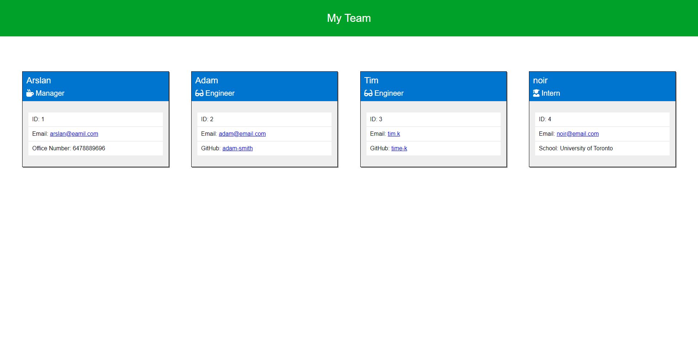

# Team Profile Generator Builder

## Description
A node.js command-line application that takes in information about employees on a software engineering team and generates an HTML webpage that displays summaries for each person.

## Table of Contents
- [Deployment URL](#Deployment-URL)
- [Repo URL](#Repo-URL)
- [Features](#Features)
- [Pre-Requisites](#Pre-Requisites)
- [Installation](#Installation)
- [Usage](#Usage)
- [Technologies Used](#Technologies-Used)
- [Tests](#Tests)
- [Questions](#Questions)
- [License](#License)

### Deployment URL
Command-line application. It is not deployed online.

### Repo URL
https://github.com/arslan-razi/team-profile-builder

## Features
1. Easy-to-use command-line application.
1. Has built-in tests using `jest`.

## Pre-Requisites
1. Install `node.js`.

## Installation
1. Download or Clone this repository.
1. Go to the command line (if you're not there already).
1. Navigate to unzipped directory.
1. Run: `npm install`.

## Usage
1. Run: `npm start` or `node index.js`.
1. Answer the prompts.
1. When finished, navigate to the `dist` folder.
1. If the app ran without errors, then you should find the `index.html` file in the `dist` folder.
1. When copying the HTML file, make sure to copy the `assets` folder, which includes the `css` styling.

### Screenshot / Gif Animation

### Video Demo
<!-- Video Link -->

## Technologies Used
1. HTML
1. CSS
1. JavaScript
1. [Node.js](https://nodejs.org/en/)
1. [Inquirer.js](https://www.npmjs.com/package/inquirer)
1. [Jest](https://www.npmjs.com/package/jest)

## Tests
This app has 4 tests, one for each `class`, using `jest`. To run the tests type the command `npm run test` in the command line.

## Questions
https://github.com/arslan-razi  or  arslan.razi@outlook.com

## License
This project is licensed under the terms of the [MIT](https://opensource.org/licenses/MIT) license.
